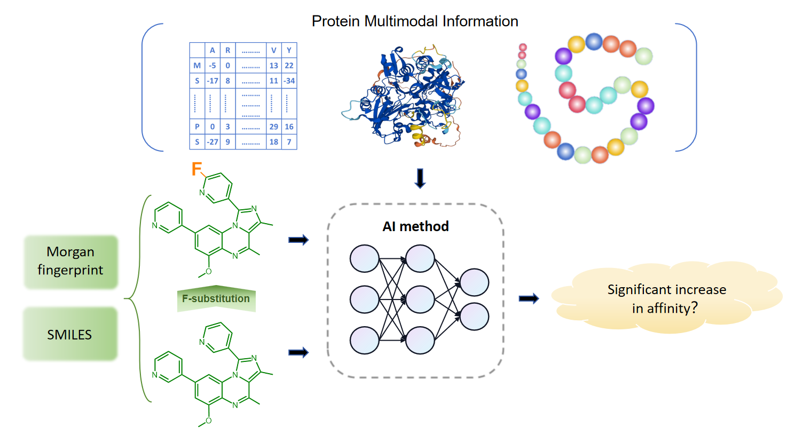

# F-CPI: A multimodal deep learning approach for predicting compound bioactivity changes induced by fluorine substitution
## 
The code for official implementation of "F-CPI: A multimodal deep learning approach for predicting compound bioactivity changes induced by fluorine substitution"
This codebase provides:
1. Models of the four modes of F-CPI
3. The optimization algorithm that could design F-substituted SMILES with high activities for target protein

## 2025/5/19
1. We have published the preprocessed dataset on Kaggle:https://www.kaggle.com/datasets/yinwenhai/f-cpi-dataset/data
2. Move the files in the data0 directory of F-CPI_data to the project directory where train.by can be run
3. For F-CPI-S, due to the involvement of pre training of other existing models and the large file size, we have provided a way to obtain pre training embeddings in this update (data/get_ pretrain_ emb (for seq))
4. We provide a way to preprocess all data in order to introduce proteins and molecules from outside the dataset for testing. （data/get_xxxx）
5. Modified some paths and adaptation code to ensure the normal operation of the project, which may require cloning the repository again
## Contents
1. [Introduction](#introduction)
2. [Environment Setup](#environment-setup)
4. [Design F-substituted Sequence](#design-F-substituted-sequence)
5. [Bibtex](#bibtex)
## Introduction <a name="introduction">

There are 297 fluorine (F)-containing compounds in the current approved drug list, and the F substitution is a common method in drug discovery and development. However, there are no accurate approaches available for predicting the bioactivity changes after F substitution, as the substitution effect on the interactions between compounds and proteins (CPI) remains a mystery. In this study, we carefully constructed a dataset with 111,168 pairs of fluorine-substituted and non-fluorine-substituted compounds. Then different-machine learning approaches were applied to develop models for predicting the CPI. The results showed that a multimodal deep learning model, called F-CPI displayed the best performance. In comparison with traditional machine learning and popular CPI task models, the accuracy, precision, and recall of F-CPI (~90%, ~79%, and ~45%) were higher than that of GraphDTA (GAT&GCN) (~86%, ~58%, and ~40%) respectively, on IC50 dataset. The application of the F-CPI for the structural optimization of hit compounds against SARS-CoV-2 3CLpro by F substitution achieved more than 100-fold increase in bioactivity (IC50: 0.23 µM vs. 28.19 µM). Therefore, the multimodal deep learning model F-CPI would be a veritable and effective tool in the context of drug discovery and design. 

<div align='center'><br></div>

the model structure
<div align='center'><br></div>

To investigate the effect of F-substitution on the bioactivity changes of small chemical compounds, we compiled the largest dataset currently containing 111,168 samples, designed a specialized framework F-CPI, and compared with multiple methods. We found that the F-CPI achieved overall satisfactory performance. In the case study, we applied F-CPI to the structural optimization of lead compounds against SARS-CoV-2 3CLpro. Impressively, in one case, with the introduction of only one F atom, the bioactivity of the molecule increased by more than two orders of magnitude (IC50: 0.23 µM vs. 28.19 µM). From the results obtained, it is imperative to note that the F-CPI has certain practical significance and is expected to provide new ideas for the discovery and design of fluorinated drugs.

<div align='center'><br></div>


## Environment Setup <a name="environment-setup">
**Env Requirements:** 
- MAC OS, Linux or Windows.
- Python 3.6.12
- PyTorch 1.10.2
- CUDA 11.3  if you need train deep learning model with gpu.
- tqdm,numpy
- rdkit,networkx...(If you wish to perform data preprocessing)

**Steps of using F-CPI:**
1. Install [Git](https://git-scm.com/), this step is optional if you does not install DeepSEED by git clone. Clone the source codes with git. 
    ```
    git clone https://github.com/ywwhhh/F-CPI.git
    ```
   or, download the source codes and extract files and put it in the virtual environment directory you defined. 


2. Create a virtual environment and download all dependencies with the following commend.
    ```
    conda create -n fcpi python=3.6.12
    conda activate fcpi
    ```
    To boost download speeds, you could setup pip mirror such as
    ```
    pip install -i https://pypi.tuna.tsinghua.edu.cn/simple -r requirements.txt  
    # or
    pip install -i https://mirrors.aliyun.com/pypi/simple  -r requirements.txt
    ```


3. Run F-CPI with python and enjoy it with following steps:

## design-F-substituted-sequence <a name="design-promoter-sequence">

### 1. Training the F-CPI 
    ```
    python train.py
    ```
### 2. Getting the pre-trained model and design the F-substituted sequence for test
    ```
    python inference.py
    ```
## Bibtex<a name="bibtex">
Please consider citing our paper in your publications if the project helps your research. BibTeX reference is as follows.

```

```

